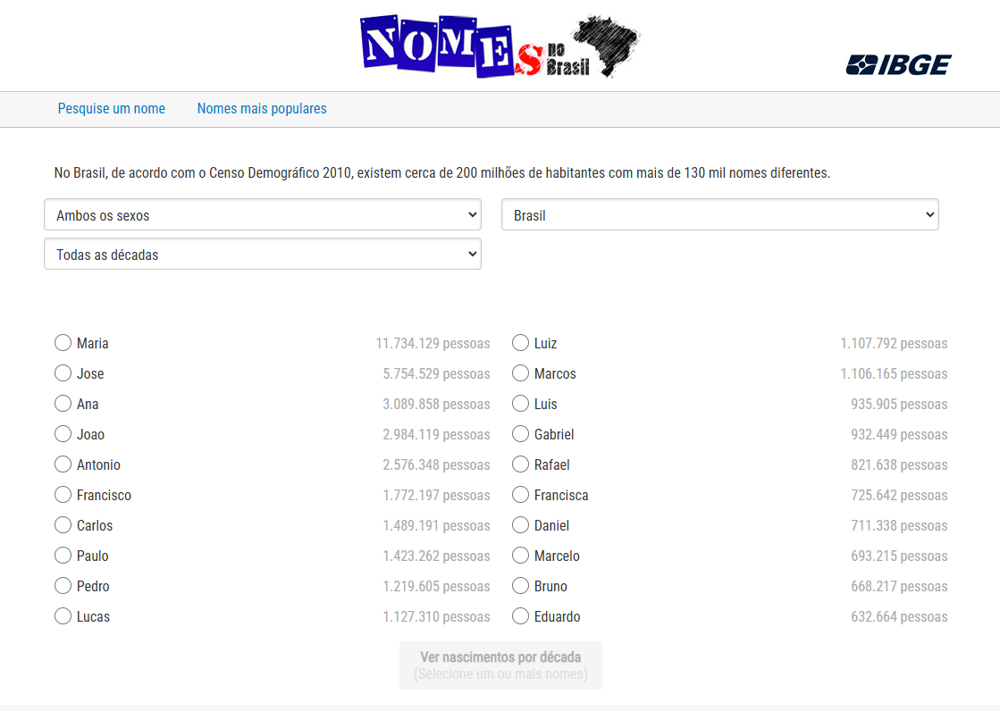

# bznames

Inspired by [Andrej Karpathy](https://github.com/karpathy)'s projects ([nn-zero-to-hero](https://github.com/karpathy/nn-zero-to-hero) and [makemore](https://github.com/karpathy/makemore)), this repository contains a fun application for generating Brazilian names. It leverages data from IBGE (the Brazilian Institute of Geography and Statistics) based on the 2010 census. In addition to the names themselves, IBGE provides the frequency of each name as of 2010, allowing this information to be incorporated into model training.

The motivation behind this project is primarily for learning purposes. The goal is to build each neural architecture from scratch, using Andrej’s approach as a guide to develop a deeper understanding of the models' inner workings.

Original data source: [IBGE](https://censo2010.ibge.gov.br/nomes/#/ranking)

