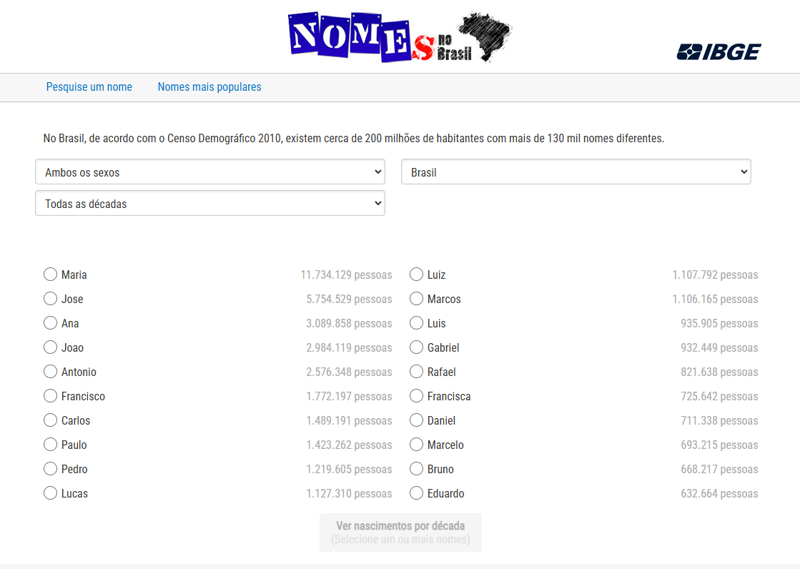

# bznames

Inspired by [Andrej Karpathy](https://github.com/karpathy)'s projects ([nn-zero-to-hero](https://github.com/karpathy/nn-zero-to-hero) and [makemore](https://github.com/karpathy/makemore)), this repository contains a character-level name generator for Brazilian names. It leverages name frequency datasets from the IBGE (Brazilian Institute of Geography and Statistics) Censo 2010, enabling weighted statistical sampling during model training.

Developed primarily for educational purposes, the goal of this project is to implement generative architectures from scratch to gain a deeper understanding of neural networks and language modeling.

## Data Reference

The names are retrieved from the official IBGE Censo 2010 database under the following conditions:
* **Scope:** First names only.
* **Secrecy Threshold:** Names must have a minimum frequency of 20 occurrences nationwide.
* **Original Data Portal:** [IBGE Nomes no Brasil (Censo 2010)](https://censo2010.ibge.gov.br/nomes/#/ranking)

